# Contributing

## Who can contribute?
Members of Track to Buy only. But if you are an outsider member, you can still fork this project and work in your changes.

## Branching rules

To start new features or bug fixes, you must start working from ```develop``` branch and make a **pull request** to ```main``` branch.



### Pull requests
When you open a Pull request, you have wait for reviewers to approve. All repositories must have at least reviewer.

## How can I edit this code?

**Use your preferred IDE**

If you want to work locally using your own IDE, you can clone this repo and push changes. Pushed changes will also be reflected in Lovable.

The only requirement is having Node.js & npm installed - [install with nvm](https://github.com/nvm-sh/nvm#installing-and-updating)

Follow these steps:

```sh
# Step 1: Clone the repository using the project's Git URL.
git clone https://github.com/tracktobuy/waiting-landing-page.git

# Step 2: Navigate to the project directory.
cd waiting-landing-page

# Step 3: Install the necessary dependencies.
npm i

# Step 4: Start the development server with auto-reloading and an instant preview.
npm run dev
```

## Deployment
_Pending pipeline_